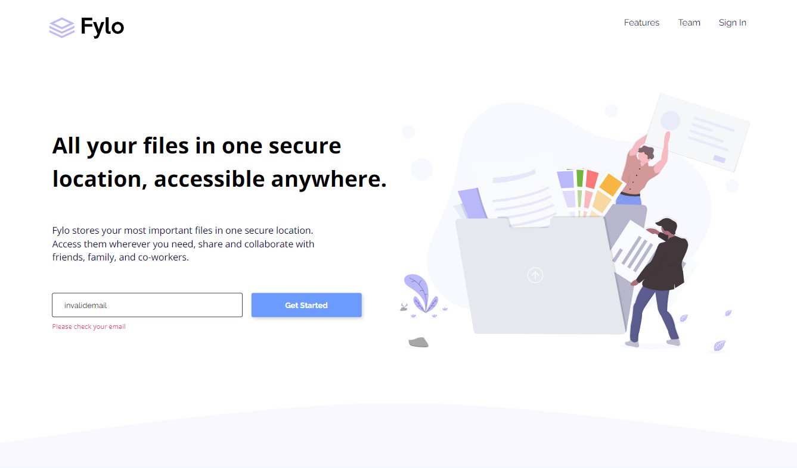
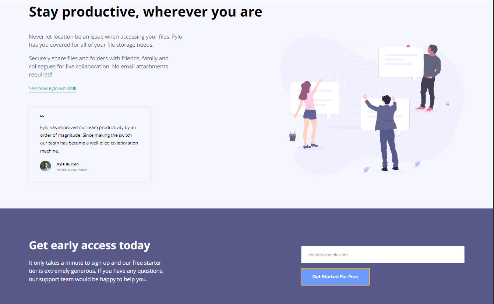

## Table of contents

- [Overview](#overview)
  - [The challenge](#the-challenge)
  - [Screenshot](#screenshot)
  - [Links](#links)
- [My process](#my-process)
  - [Built with](#built-with)
  - [What I learned](#what-i-learned)
  - [Continued development](#continued-development)
- [Author](#author)


## Overview

### The challenge

Users should be able to:

- View the optimal layout for the site depending on their device's screen size
- See hover states for all interactive elements on the page

### Screenshot




### Links

- Solution URL: [GitHub](https://github.com/gabadadzeluca/fylo-landing-page)
- Live Site URL: [Live URL]()

## My process

### Built with

- Semantic HTML5 markup
- CSS custom properties
- Flexbox
- Mobile-first workflow
- JavaScript


### What I learned

I used Javascript and interacted with user depending on input.

```
function checkOne(){
    if(field1.value.match(pattern)){
        console.log("Valid")
        field1.value = "";
        message.remove();
    }else{
        console.log("invalid");
        document.querySelector('.input-cls').append(message);
    }
}
```


### Continued development

I think the Js code wasn't very efficient. One function could do the work that was made by two functions in this case.


## Author

- LinkedIn - [@lucagabadadze](https://www.linkedin.com/in/luca-gabadadze-6068b324a/)
- GitHub - [Luca Gabadadze](https://github.com/gabadadzeluca)
